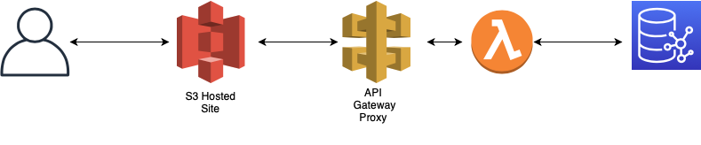

# Knowledge Graph


## CloudFormation Setup
1. Place `cf.yaml`, `cf-base.yaml`, 'cf-lambda.yaml', and `cf-ec2.yaml` into an S3 bucket in your AWS account.
2. Go to CloudFormation inside the AWS Console. Create a new stack, load from S3, and input the URL to the `cf.yaml` file in your S3 bucket.
3. Fill out the EC2SSHKeyPairName and CloudFormationS3Path parameters

      For the CloudFormationS3Path, follow this example: https://your-bucket-name.s3.amazonaws.com/

## Loading Data
1. Upload data into a S3 bucket. (sample data is provided in `sample-data`).
2. SSH into your EC2 instance created earlier.
3. Run the following command, replacing the correct values (most of these can be found from the outputs of the CloudFormation stack). NOTE: For the source, you can put a path to specific folder and Neptune will automatically load all of the data files from within that folder.
```bash
curl -X POST \
    -H 'Content-Type: application/json' \
    http://<clusterURL>:<Cluster Port>/loader -d '
    {
      "source" : "<YOUR-S3-BUCKET>/<OBJECT-KEY-NAME>",
      "format" : "<format>", #csv, ntriples, nquads, rdfxml, turtle, etc.
      "iamRoleArn" : "<NeptuneLoadFromS3ARN>",
      "region" : "<region>", #us-east-1
      "failOnError" : "FALSE",
      "parallelism" : "MEDIUM"
    }'
```

4. After entering the above, you will get something like this back:
```bash
{
    "status" : "200 OK",
    "payload" : {
        "loadId" : "ef478d76-d9da-4d94-8ff1-08d9d4863aa5"
    }
}
```
To confirm that the data was loaded correctly, run the follow code replacing '<loadId>' with the load ID from the response:
```bash
curl -G '<YOUR-CLUSTER>:<CLUSTER-PORT>/loader/<loadId>'
```

## Lambda function
1. Go to the Lambda Dashboard, open the newly made function and replace the code inside of `lambda_function.py` with the contents of `lambda.py` from this repository.

## API Gateway
The API Gateway will be used to send queries to the Neptune cluster through Lambda.
1. Go to the API Gateway dashboard in the AWS Console.
2. Click on "Create API".
3. Leave the protocol as "REST" and set it to create a new API.
4. Give the API a name and click "Create API".
5. Click on "Actions", "Create Resource".
6. Check the box next to "Configure as proxy resource". It will automaticall fill in the Resource Name and Path. Also check the box next to "Enable API Gateway CORS".
7. On the next page make sure "Lambda Function Proxy" is selected and then select the region our new lambda function was created in and start typing in the name of our lambda function
8. Click on "Actions" and "Deploy API". Give the stage a name and click "Deploy".
9. After deploying the API, you can now click on "Stages" on the left side, click on the name of the stage you just deployed and copy the "Invoke URL" located at the top of the screen. This will be used in the next part.

## Website